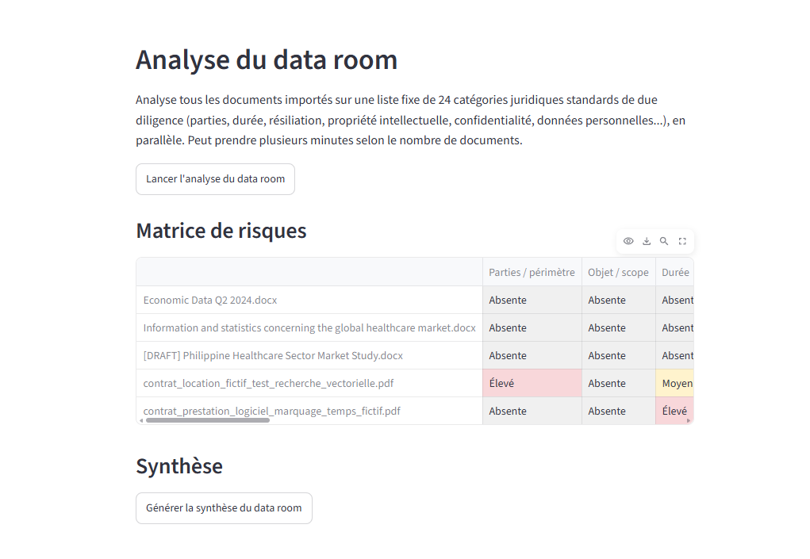

# Moteur de recherche documentaire

Projet n°3 du parcours LegalTech — application locale qui permet d'interroger le **contenu texte** des documents juridiques importés, et non plus seulement leurs métadonnées comme au projet 2. Trois façons de chercher coexistent : FTS5 (mots-clés, plein texte classique), une recherche par **sens** (embeddings OpenAI), et depuis le projet 4, la possibilité de **poser une question** à laquelle un LLM rédige une vraie réponse à partir des passages retrouvés (RAG -- retrieval-augmented generation), avec citation systématique des extraits bruts pour rester vérifiable. Depuis le projet 5, un mini **assistant d'analyse contractuelle** détecte un type de clause tapé librement dans un document, l'analyse et lui attribue un niveau de risque, avec un historique exportable en Excel. Étape finale du parcours : un **assistant de due diligence / data room**, qui généralise cette analyse de clause à tous les documents importés sur une liste fixe de 24 catégories juridiques standards, en parallèle, avec une matrice de risques croisée et une synthèse rédigée par IA.

## Fonctionnalités

- Import de documents PDF, DOCX et TXT (repris du projet 2 : `fichiers.py`, `extraction.py`)
- Indexation automatique du texte extrait à chaque import, à la fois dans l'index FTS5 (mots-clés) et dans l'index d'embeddings (sens)
- **Recherche par mots-clés** (FTS5) :
  - recherche par préfixe (« résili » retrouve « résiliation », « résiliable »...)
  - tri par pertinence (score BM25)
  - extrait du passage trouvé, avec les mots correspondants surlignés
- **Recherche par sens** (embeddings OpenAI, modèle `text-embedding-3-small`) :
  - retrouve les passages dont le sens se rapproche de la requête, même sans mot commun
  - découpe chaque document en chunks (~700 caractères, avec léger chevauchement) pour cibler un passage précis plutôt que tout le document
  - compare la requête à chaque chunk par similarité cosinus (calcul numpy, sans index vectoriel spécialisé — largement suffisant à l'échelle d'un usage personnel)
  - affiche le document, le passage correspondant et un score de proximité
- **Poser une question** (RAG, modèle de chat `gpt-4o-mini`) :
  - retrouve les 3 passages les plus pertinents par sens (score cosinus ≥ 0,15), puis les envoie à un LLM qui rédige une réponse
  - format de sortie JSON strict imposé au modèle (schéma avec deux champs distincts) : une réponse ancrée dans le document, et un éventuel complément de connaissance générale du LLM, uniquement si la question déborde du document
  - le texte cité en source n'est **jamais** demandé au LLM : c'est le `texte_chunk` déjà stocké en base à l'indexation, affiché séparément dans une section « Sources », pour rester vérifiable même si le LLM paraphrase
  - affichage visuellement distinct entre la réponse ancrée (« trouvée dans le document ») et le complément de connaissance générale (« à vérifier »)
- **Analyser une clause** (projet 5, mini assistant d'analyse contractuelle) :
  - l'utilisateur choisit un document et tape librement un type de clause (pas de liste prédéfinie), ex. « non-concurrence », « confidentialité »
  - détection en deux étapes : une présélection par similarité de sens (comme « Par sens »), puis une **vérification par le LLM** que les extraits présélectionnés correspondent vraiment à ce type de clause (voir la note d'architecture plus bas — la similarité seule ne suffit pas)
  - si confirmée : analyse rédigée par le LLM (adaptée au type de clause) + niveau de risque sur une échelle fixe (faible / moyen / élevé), affiché avec un badge coloré
  - le texte cité reste, comme pour le RAG, l'extrait brut stocké en base, jamais reformulé par le LLM
  - chaque analyse est enregistrée durablement (table `documents_clauses`), pour accumuler plusieurs analyses sans refaire d'appels API déjà payés
  - export Excel de tout l'historique accumulé (`pandas` + `openpyxl`, en mémoire, même principe que le projet 1)
- **Analyse du data room** (projet final, assistant de due diligence) :
  - un bouton lance l'analyse de TOUS les documents importés sur une liste fixe de 24 catégories juridiques standards (parties, durée, résiliation, change of control, propriété intellectuelle, données personnelles...), chacune avec ce qu'il faut vérifier et des red flags typiques envoyés au LLM pour guider l'analyse
  - même détection en deux étapes que "Analyser une clause", réutilisée telle quelle (`clauses.detecter_et_analyser`), lancée en **parallèle** (jusqu'à 8 combinaisons document x catégorie à la fois) puisque les appels API sont I/O-bound (le temps est passé à attendre le réseau, pas à calculer localement)
  - chaque case (document x catégorie) capture ses propres erreurs indépendamment : l'échec d'une case n'empêche ni les autres de s'exécuter, ni de s'enregistrer
  - **matrice de risques croisée** (documents en lignes, catégories en colonnes), colorée par niveau de risque
  - **synthèse rédigée par IA** : d'abord un comptage fiable par SQL (`GROUP BY type_clause, niveau_risque`), puis ce résumé chiffré (jamais les analyses brutes) envoyé à un appel LLM séparé qui rédige un texte de synthèse global des points d'attention
  - le mode "Analyser une clause" (recherche libre, un document à la fois) reste disponible en complément, pour des vérifications ponctuelles hors des 24 catégories fixes
- Filtre par catégorie juridique, combinable avec les trois modes de recherche
- Une recherche vide (mode mots-clés) affiche tous les documents (comme au projet 2)
- Aperçu du texte extrait, modification (catégorie/commentaire), suppression (base + fichier + les deux index)
- Import résilient à deux niveaux :
  - si l'extraction échoue (format non supporté, PDF scanné en image...), le document est quand même importé, avec un message clair indiquant qu'il ne sera pas trouvable par une recherche de contenu
  - si l'indexation par sens échoue (pas de clé API OpenAI, pas de réseau, quota dépassé...), le document reste importé et trouvable par mots-clés, avec un message clair indiquant qu'il ne sera pas trouvable par une recherche par sens
- Résilience du mode « Poser une question » : si la génération de la réponse échoue (clé absente, quota, réseau), les passages bruts retrouvés restent affichés, seule la synthèse rédigée est indisponible, avec un message clair
- Résilience de l'analyse de clauses : si la détection réussit mais que l'analyse par le LLM échoue, la clause est quand même enregistrée comme « détectée mais pas encore analysée », plutôt que de perdre la détection
- Résilience du lot data room : chaque case a son propre filet de sécurité (aucune exception ne peut se propager et interrompre les autres cases en cours), même en cas de bug totalement imprévu

## Structure du projet

```text
moteur_recherche_documentaire/
├── app.py            # interface Streamlit
├── database.py       # SQLite : table documents + index FTS5 + index embeddings + historique clauses
├── recherche.py       # construction de la requête FTS5 à partir du texte tapé
├── embeddings.py       # découpage en chunks, appel à l'API OpenAI (embeddings), similarité cosinus
├── llm.py               # RAG : prompt, appel au modèle de chat, schéma JSON imposé (projet 4)
├── clauses.py            # analyse de clauses : prompt, détection en deux étapes, schéma JSON (projet 5)
├── due_diligence.py       # 24 catégories, parallélisme, matrice, agrégation SQL, synthèse (projet final)
├── fichiers.py         # sauvegarde/suppression physique des fichiers (repris du projet 2)
├── extraction.py       # extraction du texte PDF/DOCX/TXT (repris du projet 2)
├── documents/           # fichiers importés (non versionné)
├── data/
│   └── documents.db     # base SQLite (non versionnée)
├── .env                 # OPENAI_API_KEY (non versionné, à créer soi-même)
├── tests/
│   ├── test_database.py
│   ├── test_recherche.py
│   ├── test_embeddings.py
│   ├── test_llm.py
│   ├── test_clauses.py
│   ├── test_due_diligence.py
│   ├── test_fichiers.py
│   └── test_extraction.py
├── requirements.txt
└── readme.md
```

## Installation

```powershell
python -m venv .venv
.\.venv\Scripts\Activate.ps1
pip install -r requirements.txt
```

Pour activer la recherche par sens, créer un fichier `.env` à la racine du projet avec :

```
OPENAI_API_KEY=sk-...
```

Sans cette clé, l'application fonctionne quand même : la recherche par mots-clés reste pleinement disponible, seule la recherche par sens affiche un message d'indisponibilité.

## Lancer l'application

```powershell
streamlit run app.py
```

## Lancer les tests

```powershell
python -m pytest -v
```

Les tests ne font aucun appel réseau réel à l'API OpenAI : `calculer_embedding` est mocké dans `test_embeddings.py` et `test_database.py`, `generer_reponse` (chat) dans `test_llm.py`, `analyser_clause`/`detecter_et_analyser` (chat) dans `test_clauses.py`, `generer_synthese` (chat) dans `test_due_diligence.py` -- de même que `lancer_analyse_data_room` (ThreadPoolExecutor), testée avec `clauses.detecter_et_analyser` mocké plutôt qu'avec de vrais appels API.

## Note d'architecture : pourquoi FTS5

Une recherche « classique » naïve relirait le texte de chaque document à chaque recherche (comme `if mot in texte`, utilisé pour les métadonnées au projet 2) : ça devient lent dès que le nombre ou la taille des documents grandit. FTS5 (Full-Text Search 5) construit à la place un **index inversé** : pour chaque mot, il mémorise à l'avance la liste des documents qui le contiennent. Une recherche consiste alors à consulter cet index plutôt qu'à relire tous les documents.

Deux tables SQLite coexistent :
- `documents` : les métadonnées (identique au projet 2).
- `documents_fts` : une table **virtuelle** FTS5 qui indexe le nom et le contenu texte de chaque document, reliée à `documents` par un identifiant (`doc_id`).

`database.rechercher()` interroge `documents_fts` avec l'opérateur `MATCH`, trie les résultats par pertinence avec `bm25()`, et récupère un extrait surligné avec `snippet()`. La construction de la requête (échappement, recherche par préfixe) est isolée dans `recherche.py` pour rester testable indépendamment de SQLite.

## Note d'architecture : la recherche par sens (embeddings)

FTS5 compare des **mots** : chercher « résiliation » ne retrouve pas un passage qui dit « mettre fin au contrat » s'il n'utilise pas ce mot précis. La recherche par sens répond à cette limite en comparant des **vecteurs numériques** (embeddings) plutôt que des mots.

Principe :
1. À l'import, le texte extrait est découpé en chunks (`embeddings.decouper_en_chunks`), des morceaux d'environ 700 caractères coupés aux limites de phrases, avec un léger chevauchement pour ne pas perdre une clause à cheval sur une coupure. On découpe car un embedding résume tout le texte qu'on lui donne en un seul vecteur : sur un document entier, ce résumé serait trop dilué pour retrouver un passage précis.
2. Chaque chunk est envoyé à l'API OpenAI (`embeddings.calculer_embedding`, modèle `text-embedding-3-small`), qui retourne un vecteur de 1536 nombres représentant son sens. Ce vecteur est stocké en JSON dans la table `documents_embeddings` (`doc_id`, `chunk_id`, `texte_chunk`, `vecteur`).
3. Au moment de la recherche, la requête tapée par l'utilisateur est elle aussi transformée en vecteur, puis comparée à chaque chunk stocké avec une **similarité cosinus** (`embeddings.similarite_cosinus`) : plus deux vecteurs « pointent dans la même direction », plus les textes qu'ils représentent ont un sens proche.
4. Les chunks sont triés par score décroissant, et les meilleurs sont retournés (`database.rechercher_par_sens`).

Pas d'index vectoriel spécialisé (type FAISS ou Chroma) : à l'échelle d'un outil personnel (quelques dizaines/centaines de documents), comparer la requête à chaque chunk un par un en Python est largement assez rapide, et bien plus simple à comprendre qu'un index dédié. Un tel index deviendrait pertinent à beaucoup plus grande échelle.

La clé API OpenAI est chargée depuis un fichier `.env` (jamais commité sur Git — un fichier `.env` contient un secret qui donnerait accès au compte OpenAI de l'utilisateur, et donc à sa facturation, à quiconque le lirait, même sur un dépôt privé) via `python-dotenv`. Si la clé est absente, ou si l'appel API échoue pour toute autre raison, l'import du document et la recherche par mots-clés continuent de fonctionner normalement : seule la recherche par sens est indisponible, avec un message clair.

## Note d'architecture : le RAG (projet 4, `llm.py`)

La recherche par sens retrouve des passages ; elle ne rédige rien. Le RAG (Retrieval-Augmented Generation) ajoute une étape : une fois les passages retrouvés, on les donne à un LLM comme contexte et on lui demande de rédiger une vraie réponse -- sans jamais lui laisser deviner le contenu des documents à partir de sa mémoire générale, puisqu'il n'a accès qu'à ce qu'on lui envoie explicitement dans le prompt.

Principe (`llm.generer_reponse`) :
1. `database.rechercher_par_sens()` retrouve jusqu'à `llm.NB_CHUNKS_CONTEXTE` (3) chunks, puis `llm.filtrer_chunks_pertinents()` élimine ceux en dessous de `llm.SEUIL_SIMILARITE_MINIMAL` (0,15) : mieux vaut répondre "pas d'information pertinente" que fournir un contexte hors-sujet au modèle.
2. `llm.construire_messages()` assemble un message système (les règles ci-dessous) et un message utilisateur (la question + les extraits numérotés, chacun rattaché au nom de son document).
3. L'appel au modèle de chat (`gpt-4o-mini`) impose un **schéma JSON strict** (`llm.SCHEMA_REPONSE`, via le paramètre `response_format` de l'API) : le modèle ne peut pas répondre en texte libre. Deux champs, obligatoires :
   - `reponse_document` : la réponse, rédigée uniquement à partir du contexte fourni ;
   - `complement_connaissance_generale` : `null`, sauf si la question déborde volontairement du document (ex. « quel est le régime juridique général d'une clause de non-concurrence » en plus de « que dit cette clause dans ce contrat »).

   Un format libre ne suffirait pas : le code ne peut pas distinguer de façon fiable, dans un texte en prose, ce qui vient du document de ce qui vient de la culture générale du modèle. Le schéma JSON force cette séparation. **Constaté en conditions réelles pendant le développement** : même avec un schéma strict, le modèle renvoie parfois la chaîne de caractères `"null"` au lieu du JSON `null` attendu quand il n'a rien à ajouter -- `generer_reponse()` normalise ce cas explicitement, pour ne jamais afficher le mot "null" à l'utilisateur comme s'il s'agissait d'un vrai complément.
4. **La citation de la source n'est jamais demandée au LLM** (risque de légère reformulation). L'extrait affiché dans la section « Sources » de `app.py` est le `texte_chunk` déjà stocké tel quel dans `documents_embeddings` à l'indexation -- la même donnée que pour la recherche par sens. Principe retenu pour ce projet : tout ce que le code sait déjà de façon fiable ne doit pas être redemandé au LLM.
5. Résilience : `generer_reponse()` ne rattrape aucune erreur (comme `calculer_embedding`) -- `embeddings.CleApiManquante` ou une exception `openai` (réseau, quota...) remonte jusqu'à `app.py`, qui affiche un message clair à la place de la synthèse, sans empêcher l'affichage des passages bruts déjà retrouvés.

## Note d'architecture : l'analyse de clauses (projet 5, `clauses.py`)

Objectif : taper librement un type de clause (pas de liste prédéfinie) pour un document donné, détecter si elle existe, la faire analyser par un LLM avec un niveau de risque, et accumuler l'historique pour un export Excel.

**Détection en deux étapes -- pas une seule.** Un point important, découvert en testant en conditions réelles pendant le développement : la seule similarité cosinus ne suffit pas à décider fiablement si une clause précise est présente ou non. Sur un contrat de test ne contenant qu'une clause de non-concurrence, demander « clause de brevet et de droits d'auteur » (absente du document) obtenait un score de similarité de 0,39 -- plus élevé que le score de 0,34 obtenu en cherchant "non-concurrence" (la clause réellement présente, mais ailleurs dans un autre test) ! Deux clauses du même domaine juridique peuvent avoir un score de similarité proche même quand l'une des deux n'existe pas dans le document : la similarité de sens capte surtout le domaine (« c'est du droit du travail ») plus finement que le sujet précis. Pire : demander au LLM d'analyser directement ce passage comme s'il s'agissait de la clause demandée a produit une analyse détaillée avec un niveau de risque « élevé », alors que le document ne traite pas du tout du sujet demandé -- le LLM avait bien remarqué l'incohérence dans son texte, mais produisait quand même une analyse complète plutôt que de refuser.

La détection se fait donc en deux étapes, avec un rôle différent à chacune :
1. **Présélection (rappel)** : `database.rechercher_par_sens(type_clause, doc_id=...)` puis `llm.filtrer_chunks_pertinents()` (réutilisés tels quels, même seuil `llm.SEUIL_SIMILARITE_MINIMAL`) retrouvent des **candidats** -- orientés "ne rien rater", pas "ne jamais se tromper".
2. **Vérification (précision)** : `clauses.analyser_clause()` impose un schéma JSON (`clauses.SCHEMA_ANALYSE_CLAUSE`) avec un champ `clause_correspond` (booléen) que le LLM doit remplir *avant* de rédiger son analyse, en vérifiant lui-même si les extraits présélectionnés correspondent vraiment au type de clause demandé. Si `clause_correspond` vaut `false`, `app.py` traite la clause comme **absente**, même si l'étape 1 avait trouvé un candidat au-dessus du seuil -- l'analyse et le niveau de risque produits dans ce cas ne sont jamais enregistrés.

**Schéma JSON strict** (`clauses.SCHEMA_ANALYSE_CLAUSE`), trois champs obligatoires : `clause_correspond` (booléen, la vérification ci-dessus), `analyse` (texte libre, adapté au type de clause précis -- volontairement un champ générique plutôt que des champs fixes par type de clause, les critères pertinents variant trop d'un type à l'autre), `niveau_risque` (`enum` strict à 3 valeurs : `faible`/`moyen`/`élevé`, seul champ réellement structuré et exploitable dans l'export).

**Citation et stockage**, mêmes principes que le RAG : le texte affiché (`texte_extrait`) est toujours l'extrait brut tel que stocké en base, jamais reformulé par le LLM. Chaque analyse est enregistrée durablement dans `documents_clauses` (`doc_id`, `type_clause`, `clause_presente`, `texte_extrait`, `analyse`, `niveau_risque`, `date_analyse`), y compris en cas d'échec de l'appel au LLM après une détection réussie (`analyse`/`niveau_risque` restent `NULL` : « détectée mais pas encore analysée » plutôt qu'une détection perdue) -- accumuler l'historique évite de refaire des appels API déjà payés, et prépare le terrain pour le projet final (due diligence multi-documents).

**Export Excel** (`app.py`) : même principe que le projet 1 (`pandas.ExcelWriter` + `openpyxl` pour la mise en forme, fichier construit en mémoire via `io.BytesIO`, jamais écrit sur disque), une ligne par analyse enregistrée dans `documents_clauses`, tous documents confondus.

## Note d'architecture : l'analyse du data room (projet final, `due_diligence.py`)

Dernière étape du parcours : généraliser "Analyser une clause" (un document, un type de clause tapé librement) à un **data room entier** (tous les documents, une liste fixe de 24 catégories juridiques standards), avec une matrice de risques et une synthèse globale.

**Réutilisation, pas duplication.** Le bouton "Analyser une clause" (projet 5) et le scan du data room appellent tous les deux `clauses.detecter_et_analyser(doc_id, type_clause, ce_qu_il_faut_verifier=None, red_flags=None)`, extraite pendant cette étape de ce qui était auparavant codé en dur dans `app.py`. Cette fonction ne lève jamais d'exception : elle retourne toujours un dict avec une clé `"statut"` (`"detection_indisponible"`, `"absente"`, `"presente"` ou `"detectee_non_analysee"`), ce qui permet de la réutiliser aussi bien depuis un bouton (un appel à la fois) que depuis un thread parallèle (où une exception ferait perdre le résultat des autres tâches du lot). Les deux paramètres optionnels (`ce_qu_il_faut_verifier`, `red_flags`) enrichissent le prompt envoyé au LLM avec les critères de la catégorie fixe, plutôt qu'un simple nom de clause tapé librement.

**Les 24 catégories** (`due_diligence.CATEGORIES_DUE_DILIGENCE`) : une liste de dictionnaires `{"nom", "verification", "red_flags"}`, checklist standard de due diligence contractuelle (parties/périmètre, objet, durée, résiliation, change of control, cession, prix, engagements de volume/exclusivité, responsabilité, indemnisation, garanties, propriété intellectuelle, confidentialité, données personnelles/cybersécurité, sous-traitance, SLA, audit, non-concurrence, compliance, assurance, force majeure, droit applicable, modification du contrat, survie des obligations).

**Parallélisme** (`due_diligence.lancer_analyse_data_room`, `concurrent.futures.ThreadPoolExecutor`, `max_workers=8`) : chaque case de la matrice (document x catégorie) passe par un ou deux appels à l'API OpenAI. Ces appels sont **I/O-bound** : l'essentiel du temps est passé à *attendre* une réponse réseau, pas à calculer localement -- plusieurs peuvent donc être lancés en même temps sans ralentir le CPU de la machine (contrairement à un traitement CPU-bound, où le parallélisme n'aiderait pas au-delà du nombre de coeurs, et où un GPU ferait une différence -- pas ici, le calcul se fait côté serveurs OpenAI). `max_workers` limite quand même le nombre d'appels simultanés pour respecter les limites de débit ("rate limits") de l'API, au-delà desquelles elle renvoie des erreurs HTTP 429.

Les threads ne font QUE des appels API et des lectures SQLite (sans risque en lecture concurrente). **L'écriture en base se fait uniquement dans le thread principal**, au fur et à mesure que les résultats arrivent (`as_completed`) -- ce qui évite complètement toute question d'écriture SQLite concurrente entre threads. `analyser_case()` (soumise à chaque thread) a en plus son propre filet de sécurité (`try/except` autour de l'appel à `detecter_et_analyser`) : même si cette dernière ne devrait normalement jamais lever d'exception, un bug totalement imprévu dans un thread ne doit jamais faire perdre le résultat des dizaines d'autres tâches du lot en interrompant la boucle du thread principal.

**Matrice de risques** (`due_diligence.construire_matrice`) : pivote `database.lire_analyses_clauses()` en tableau documents x catégories avec `pandas`, coloré par niveau de risque (`st.dataframe(matrice.style.map(...))`). Ne garde que la ligne la **plus récente** par (document, catégorie) : sans ça, relancer l'analyse du data room après l'ajout de nouveaux documents laisserait d'anciennes valeurs mélangées aux nouvelles.

**Agrégation SQL puis synthèse LLM** (`due_diligence.agreger_resultats_data_room` + `generer_synthese`) : `database.compter_analyses_par_risque()` fait un vrai `GROUP BY type_clause, niveau_risque` en SQL -- c'est le code qui compte, jamais le LLM. Point technique à noter : le dédoublonnage "ligne la plus récente par (document, catégorie)" se fait sur `id` (auto-incrémenté, toujours unique) plutôt que sur `date_analyse`, car `CURRENT_TIMESTAMP` n'a qu'une résolution à la seconde en SQLite -- deux lignes écrites la même seconde (plausible avec le lot parallélisé) auraient sinon la même valeur et fausseraient le comptage. Le texte compact obtenu (jamais les analyses brutes) est ensuite envoyé à un unique appel LLM séparé qui rédige la synthèse. Contrairement aux autres appels LLM du projet, **pas de schéma JSON strict** ici : la sortie est un seul texte narratif, sans champ à distinguer d'un autre (pas de séparation contexte/connaissance générale comme au RAG, pas de vérification comme aux clauses) -- imposer une structure n'aurait rien apporté.
